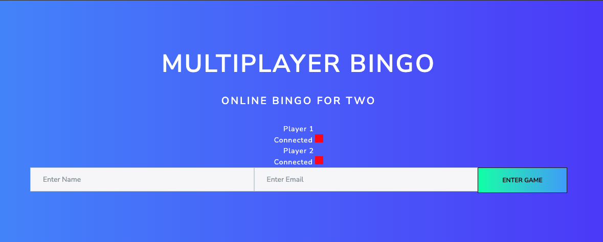
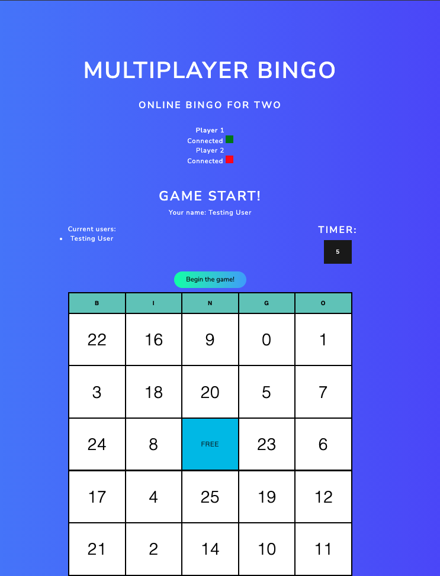

# Bingo!

A lightweight bingo game which utilizes websockets to allow for multiplayer.

## Installation

1. `git clone` the repo and `cd` to the directory
1. `npm install`
1. Insert vars for `.env`. You'll need `MAILGUN_API_KEY` and `EMAIL_DOMAIN`.
1. `node app.js`
1. Open `localhost:3000` in your browser
1. ???
1. Profit

## Screenshots

## Todo

- [x] Enter Name to generate player and board (Start Game)
- [x] Create a Canvas/ 5x5 Board
- [x] Test Canvas/Board
- [x] Create Random Numbers for the board
- [x] Create Random Numbers outside of board, on a timer
- [x] Validate Player's matching input/number
- [x] Winner Sequence
- [x] (optional) send winner's reciept to email
- [x] Multiplayer Socket.io
- [x] (Stretch) Save player's name to Game Room?
- [x] (Stretch) Game Room limits amount of players
- [x] (Stretch) Control Sound & Effects
- [ ] (Stretch) Player Host (Host Holds all the privileges)
- [ ] (Stretch) Generate Random Board Color
- [ ] (Stretch) Create Board Size (ie; 4x4, 5x5, 6x6, etc.)

## Team

- [sree-chikati](https://github.com/sree-chikati) - _Front/backend_
- [benchan777](https://github.com/benchan777) - _Backend & MVP (minimum viable product)_
- [CptnReef](https://github.com/CptnReef) - _Backend_
